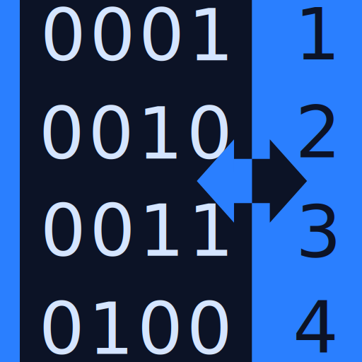
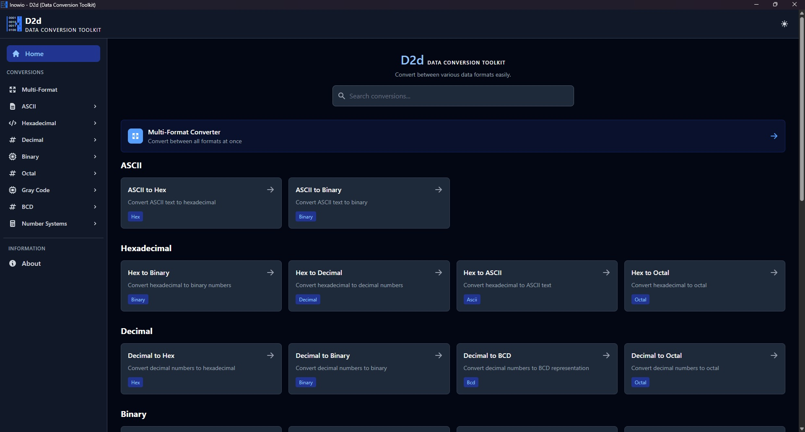
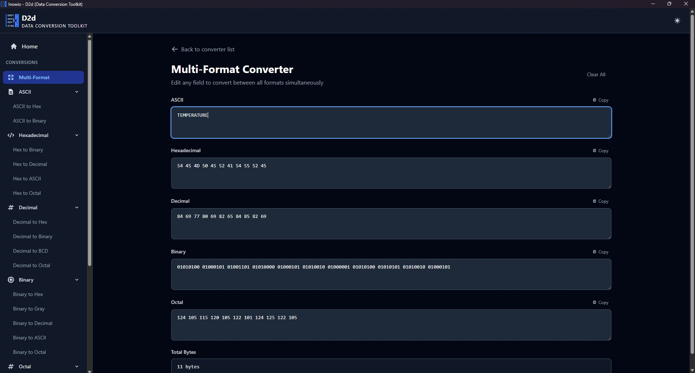
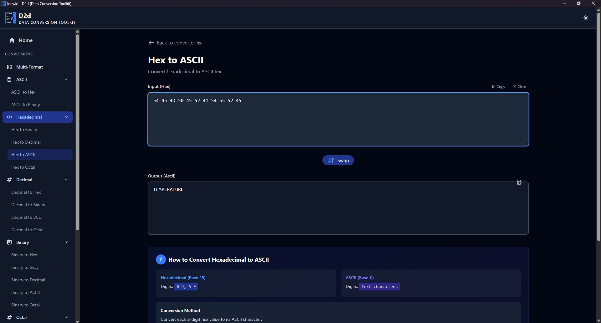
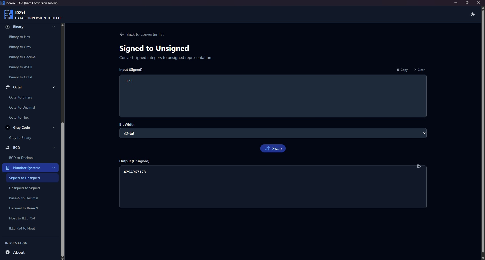
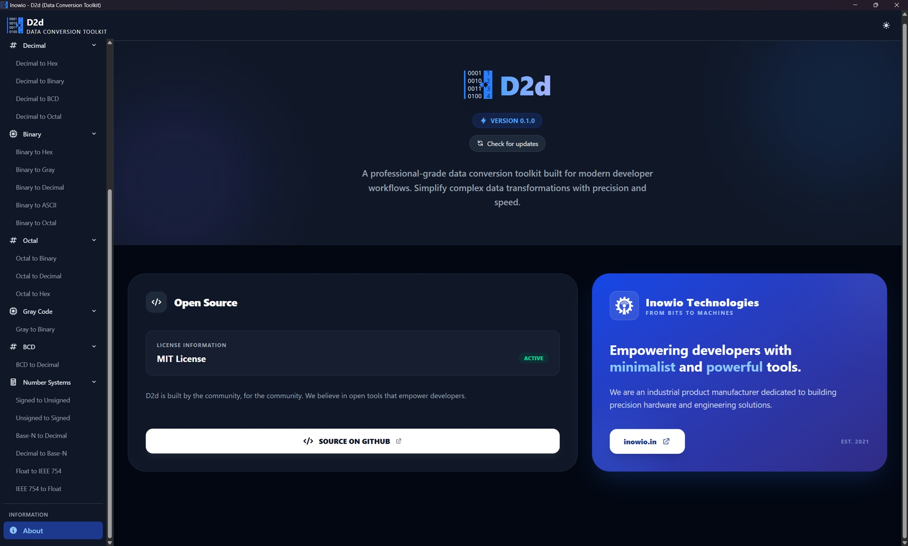

# Inowio D2d — Data Conversion Toolkit

[](LICENSE)
[](#install)
[](https://tauri.app)

D2d is a fast, fully offline data-conversion toolkit for engineers, embedded
developers, and anyone working close to the bits. Convert between binary,
hexadecimal, decimal, octal, ASCII, Gray code, BCD, and advanced number
systems — each conversion comes with a step-by-step explanation, a worked
example, and a reference table. Built with Tauri, React, and TypeScript for a
lightweight, cross-platform experience.



## Screenshots

| | |
| --- | --- |
|  |  |
|  |  |
|  | |

## Highlights

- **26 conversion tools** across 8 categories — Binary, Hexadecimal, Decimal,
  Octal, ASCII, Gray code, BCD, and advanced number systems
- **Multi-Format converter** — edit any field and every other format updates
  instantly
- **Learn while you convert** — step-by-step explanations, worked examples,
  and reference tables for each conversion
- **Quality-of-life UX** — one-click direction swap, copy-to-clipboard for
  inputs and outputs, and a searchable conversion catalog
- **Arbitrary-precision** integer conversions via BigInt — no 32/64-bit
  overflow
- **Advanced numerics** — signed/unsigned (8/16/32/64-bit), Base-N (2–36),
  and IEEE 754 single/double precision
- Dark/light theming and a mobile-responsive UI
- Runs fully offline as a native app for Windows, macOS, Linux, and Android
- Desktop builds auto-update from signed GitHub releases; mobile builds
  update through their app stores

## Conversions

| Category          | Conversions |
| ----------------- | ----------- |
| **ASCII**         | ASCII ⇄ Hex, ASCII ⇄ Binary |
| **Hexadecimal**   | Hex ⇄ Binary, Hex ⇄ Decimal, Hex ⇄ Octal, Hex ⇄ ASCII |
| **Decimal**       | Decimal ⇄ Hex, Decimal ⇄ Binary, Decimal ⇄ Octal, Decimal → BCD |
| **Binary**        | Binary ⇄ Hex, Binary ⇄ Decimal, Binary ⇄ Octal, Binary ⇄ ASCII, Binary ⇄ Gray |
| **Octal**         | Octal ⇄ Binary, Octal ⇄ Decimal, Octal ⇄ Hex |
| **Gray Code**     | Binary ⇄ Gray |
| **BCD**           | Decimal → BCD, BCD → Decimal |
| **Number Systems**| Signed ⇄ Unsigned, Base-N ⇄ Decimal, Float ⇄ IEEE 754 |

The catalog is intentionally easy to extend — see
[CONTRIBUTING.md](CONTRIBUTING.md#adding-a-new-conversion).

## Install

There are two ways to get D2d:

1. **Download a pre-built installer** from the
   **[Releases page](https://github.com/inowio/D2d/releases)** and pick the
   one for your OS.
2. **Build it from source** — see [Getting Started](#getting-started).

| OS      | Installer            | Auto-update | Notes                                   |
| ------- | -------------------- | ----------- | --------------------------------------- |
| Windows | `*-setup.exe` (NSIS) | Yes         | Recommended for personal/desktop installs. |
| Windows | `*.msi`              | No          | For MDM / IT-managed deployments.       |
| macOS   | `*.dmg`              | Yes         | Open it, then drag D2d to Applications. |
| Linux   | `*.AppImage`         | Yes         | Mark it executable, then run.           |
| Linux   | `*.deb` / `*.rpm`    | No          | For Debian/Ubuntu and Fedora/RHEL.      |
| Android | `*.apk`              | Via store   | Updates arrive through the app store.   |

> **First-launch warning.** D2d binaries are currently unsigned at the OS
> level, so the first time you run the app Windows SmartScreen will show
> "Windows protected your PC" — click **More info → Run anyway**. macOS
> Gatekeeper will say the app cannot be opened — right-click the app and
> choose **Open**, then confirm. This is a one-time approval per machine.

### How updates work

Desktop builds (Windows, macOS, Linux) include an in-app auto-updater. On
startup the app checks the latest GitHub release; if a newer version exists
it prompts you to install. You can also trigger the check manually from the
**About** page. Update artifacts are minisign-signed, so a tampered download
is rejected. The `.msi`, `.deb`, and `.rpm` packages are excluded from
auto-update by design — re-install those manually.

Android and iOS builds do **not** self-update. Mobile updates are delivered
by the Google Play Store and Apple App Store when a new version is published
there.

## Getting Started

### Requirements

- **Node.js 20.19+** (or 22.12+) — required by Vite 7
- **Rust** (stable) + platform build tools:
  - Windows — Visual Studio Build Tools (Desktop C++)
  - macOS — Xcode Command Line Tools
  - Linux — `build-essential`, `webkit2gtk`, and friends (see the
    [Tauri prerequisites](https://tauri.app/start/prerequisites/))
- **For Android builds only** — Android SDK + NDK and JDK 17, configured per
  the [Tauri Android guide](https://tauri.app/start/prerequisites/#android)

### Quick Start

```bash
git clone https://github.com/inowio/D2d.git
cd D2d
npm install
npm run tauri dev
```

### Production Build

```bash
npm run tauri build
# Installers land in src-tauri/target/release/bundle
```

### Android

```bash
npm run tauri android dev     # run on a connected device or emulator
npm run tauri android build   # build a release APK / AAB
```

## Development

```bash
npm run dev         # Vite frontend only (runs in a browser)
npm run tauri dev   # Full desktop app (frontend + Rust shell)
npm run build       # Type-check and build the production frontend
npm run preview     # Serve the production frontend build locally
npm run test        # Run the unit test suite (Vitest)
```

The conversion engine lives in
[`src/utils/conversions.ts`](src/utils/conversions.ts) and is plain,
dependency-free TypeScript — it behaves identically in a browser and inside
the Tauri webview, which makes it easy to test in isolation.

## Testing

D2d ships with 100+ unit tests covering every conversion function. Run them
with:

```bash
npm run test
```

See [TESTING.md](TESTING.md) for coverage details and conventions.

## Project Structure

```
D2d/
├── .github/          # GitHub Actions release workflow
├── src/              # React + TypeScript UI
│   ├── components/   # Navbar, Sidebar, UpdateDialog
│   ├── contexts/     # Theme (dark/light) context
│   ├── pages/        # Home, Converter, Multi-Format, About
│   └── utils/        # Conversion engine, explanations, clipboard, updater
├── src-tauri/        # Rust shell, Tauri config, icons, Android project
├── scripts/          # Release version-bump script
├── docs/             # Maintainer documentation (RELEASING.md)
├── public/           # Static assets (logos, fonts)
└── dist/             # Production frontend build output
```

## Troubleshooting

- **Build failures** — reinstall dependencies (`npm ci`), update the Rust
  toolchain (`rustup update`), and confirm platform build tools are present.
- **Blank window on `tauri dev`** — make sure the Vite dev server port
  `1420` is free; D2d uses a fixed, strict port.
- **Android build issues** — verify `ANDROID_HOME`, the NDK path, and JDK 17
  are set as described in the Tauri Android guide.

## Contributing

Contributions are welcome. Please read [CONTRIBUTING.md](CONTRIBUTING.md)
before opening an issue or pull request — it covers the workflow, coding
standards, and how to add a new conversion. Conventional commits, tests, and
linted code help us review quickly.

Maintainers cutting a release: see [docs/RELEASING.md](docs/RELEASING.md).

## License

Released under the [MIT License](LICENSE).

## Support & Contact

- Issues: <https://github.com/inowio/D2d/issues>
- Discussions: <https://github.com/inowio/D2d/discussions>
- Email: <inowio@outlook.com>

---

**Inowio Technologies LLP**
– From Bits to Machines.
[https://inowio.in](https://inowio.in)
